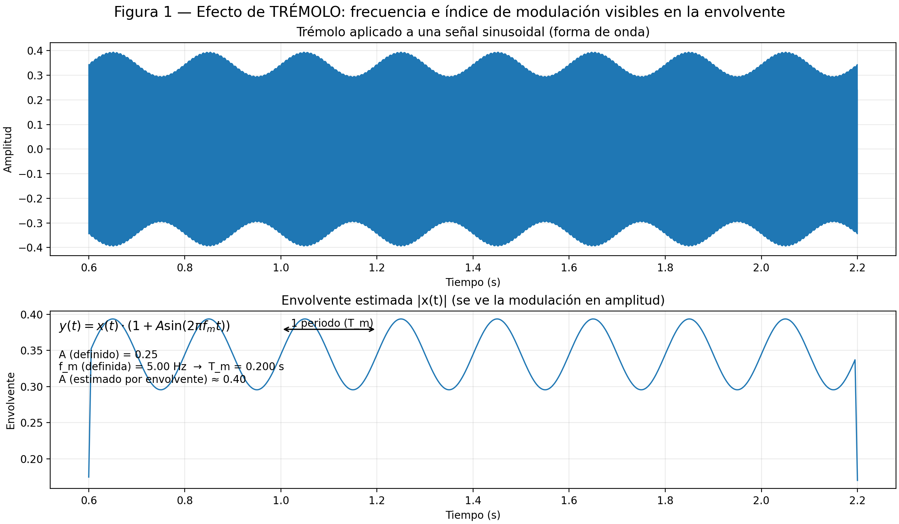
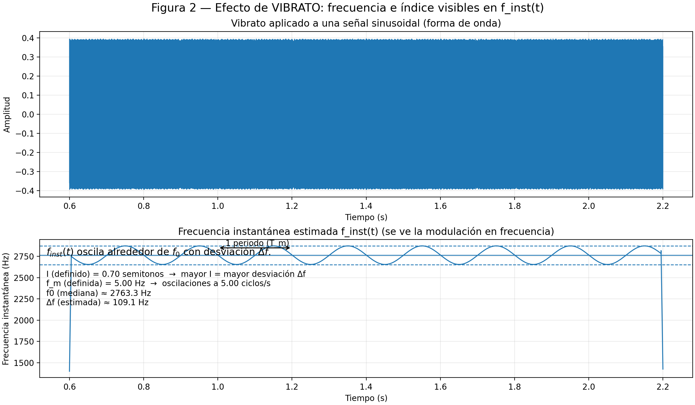
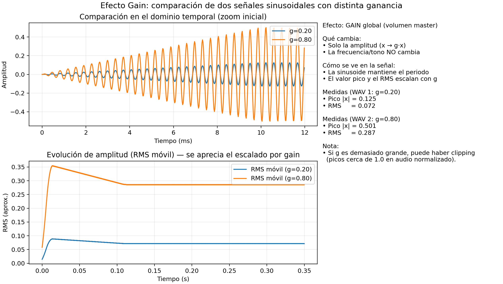

PAV - P5: síntesis musical polifónica
=====================================

Obtenga su copia del repositorio de la práctica accediendo a [Práctica 5](https://github.com/albino-pav/P5)
y pulsando sobre el botón `Fork` situado en la esquina superior derecha. A continuación, siga las
instrucciones de la [Práctica 2](https://github.com/albino-pav/P2) para crear una rama con el apellido de
los integrantes del grupo de prácticas, dar de alta al resto de integrantes como colaboradores del proyecto
y crear la copias locales del repositorio.

Como entrega deberá realizar un *pull request* con el contenido de su copia del repositorio. Recuerde que
los ficheros entregados deberán estar en condiciones de ser ejecutados con sólo ejecutar:

~~~~~~~~~~~~~~~~~~~~~~~~~~~~~~~~~~~~~~~~~~~~~~~~~~~~~.sh
  make release
~~~~~~~~~~~~~~~~~~~~~~~~~~~~~~~~~~~~~~~~~~~~~~~~~~~~~

A modo de memoria de la práctica, complete, en este mismo documento y usando el formato *markdown*, los
ejercicios indicados.

Ejercicios
----------

### Envolvente ADSR

Tomando como modelo un instrumento sencillo (puede usar el InstrumentDumb), genere cuatro instrumentos que
permitan visualizar el funcionamiento de la curva ADSR.

* Un instrumento con una envolvente ADSR genérica, para el que se aprecie con claridad cada uno de sus
  parámetros: ataque (A), caída (D), mantenimiento (S) y liberación (R).
* Un instrumento *percusivo*, como una guitarra o un piano, en el que el sonido tenga un ataque rápido, no
  haya mantenimiemto y el sonido se apague lentamente.
  * Para un instrumento de este tipo, tenemos dos situaciones posibles:
    * El intérprete mantiene la nota *pulsada* hasta su completa extinción.
    * El intérprete da por finalizada la nota antes de su completa extinción, iniciándose una disminución
      abrupta del sonido hasta su finalización.
  * Debera representar en esta memoria **ambos** posibles finales de la nota.
* Un instrumento *plano*, como los de cuerdas frotadas (violines y semejantes) o algunos de viento. En
  ellos, el ataque es relativamente rápido hasta alcanzar el nivel de mantenimiento (sin sobrecarga), y la
  liberación también es bastante rápida.

Para los cuatro casos, deberá incluir una gráfica en la que se visualice claramente la curva ADSR. Deberá
añadir la información necesaria para su correcta interpretación, aunque esa información puede reducirse a
colocar etiquetas y títulos adecuados en la propia gráfica (se valorará positivamente esta alternativa).

## Envolvente ADSR — Generació d'instruments i figures (P5)

Aquest apartat mostra la implementació i la visualització de la corba **ADSR** (*Attack, Decay, Sustain, Release*) a partir d’un instrument base senzill (**InstrumentDumb**).  
S’han definit **quatre instruments** amb comportaments típics (genèric, percussiu i pla) i s’han generat **gràfiques normalitzades** (amplitud entre 0 i 1) per entendre clarament el paper de cada paràmetre.

---

### Objectiu

* Definir quatre instruments amb **envolvents ADSR diferenciades** segons l'enunciat.
* Generar figures on es visualitzin clarament les fases: **Atac (A)**, **Caiguda (D)**, **Manteniment (S)** i **Alliberament (R)**.
* Aportar la informació mínima necessària per interpretar-les (títols, eixos i etiquetes).

---

### Estructura de fitxers

| Tipus | Fitxer / carpeta | Descripció |
| ----- | ---------------- | ---------- |
| Definició instruments | `adsr_instruments.orc` | Conté els 4 instruments basats en *InstrumentDumb* amb ADSR diferenciades |
| Partitura | `adsr_score.sco` | Seqüència de notes per executar cada instrument i generar el so |
| Script figures | `work/grafica_ignasi.py` | Genera les figures ADSR normalitzades i les guarda en PNG |
| Sortida figures | `work/figs/` | Carpeta amb totes les imatges generades |

---

### Instruments implementats

A continuació es descriu cadascun dels instruments creats, indicant la seva **caracterització** i el **fitxer d’imatge** associat.

> **Nota sobre les figures:** Les gràfiques s’han generat de forma **normalitzada** per facilitar la comparació visual de les fases (0 → silenci, 1 → màxim relatiu).

---

#### 1) ADSR genèrica (visualització pedagògica de paràmetres)

Instrument dissenyat per distingir amb claredat totes les fases:

* **Atac** progressiu fins al pic.
* **Caiguda** fins al nivell de **manteniment**.
* **Manteniment** estable mentre la nota està activa.
* **Alliberament** gradual fins a 0.

* Definició: `adsr_instruments.orc` (Instrument **1**)
* Figura: `work/figs/adsr_generica.png`

**⬇️ Figura**


---

#### 2) Instrument percussiu (guitarra/piano) — atac ràpid, sense manteniment, extinció lenta

Model típic de so percussiu:

* **Atac molt curt** (transitori inicial marcat).
* **Sense sosteniment** (S ≈ 0).
* El so es **va apagant progressivament** fins a desaparèixer.

* Definició: `adsr_instruments.orc` (Instrument **2**)
* Figura: `work/figs/percusivo_nota_mantenida_hasta_extinguir.png`

**⬇️ Figura:**  

`percusivo_nota_mantenida_hasta_extinguir.png`

---

#### 3) Instrument percussiu tallat — finalització abans de l'extinció completa

Mateix caràcter percussiu però amb final anticipat:

* **Atac molt curt**.
* **Sense sosteniment** (S ≈ 0).
* La nota finalitza abans de desaparèixer sola, i entra abans en **alliberament**.

* Definició: `adsr_instruments.orc` (Instrument **3**)
* Figura: `work/figs/percusivo_suelta_temprana_con_corte.png`

**⬇️ Figura:**  

`percusivo_suelta_temprana_con_corte.png`

---

#### 4) Instrument pla (cordes frotades / vent) — atac fins a S sense sobrecàrrega, alliberament ràpid

Model típic d'instruments sostinguts (p. ex. violí o vent):

* **Atac relativament ràpid** fins al nivell de sosteniment, **sense sobrepassar-lo**.
* **Manteniment** clar i estable.
* **Alliberament** també **ràpid** en deixar la nota.

* Definició: `adsr_instruments.orc` (Instrument **4**)
* Figura: `work/figs/instrumento_plano_cuerdas_frotadas_o_viento.png`

**⬇️ Figura:**  

`instrumento_plano_cuerdas_frotadas_o_viento.png`


### Instrumentos Dumb y Seno.

Implemente el instrumento `Seno` tomando como modelo el `InstrumentDumb`. La señal **deberá** formarse
mediante búsqueda de los valores en una tabla.

- Incluya, a continuación, el código del fichero `seno.cpp` con los métodos de la clase Seno.
 
En el nostre cas es diu 'instrument_seno.cpp'

  ```cpp
  #include "instrument_seno.h"
  #include <math.h>
  #include <iostream>

  using namespace std;
  using namespace upc;

  InstrumentSeno::InstrumentSeno(const std::string &params)
  : adsr(SamplingRate, params) {
    
      x.resize(BSIZE);
      bActive = false;
      
      KeyValue kv(params); 
      int N;
      if (!kv.to_int("N",N)) 
        N = 40;
      tbl.resize(N);
      float phase = 0;
      float stepTbl = 2 * 3.1415926 / (float) N;
      for (int i = 0; i < N; ++i) {
          tbl[i] = sin(phase);
          phase += stepTbl;
      }
      id = 0;
  }


  void InstrumentSeno::command(long cmd, long note, long vel) {
      if (cmd == 9) {    
          bActive = true;
          adsr.start();
          float freq = pow(2.0, (note - 69.0) / 12.0) * 440.0;
          step = freq * 2.0 * 3.1415926 / SamplingRate;
          A = vel / 127.0;
          phaseIndex = 0;
          id = 0;
      }
      else if (cmd == 8) { 
          adsr.stop();
      }
      else if (cmd == 0) { 
          adsr.end();
      }
  }

  const std::vector<float>& InstrumentSeno::synthesize() {
    if (!adsr.active()) {
        x.assign(x.size(), 0.0f);
        bActive = false;
        return x;
    }
    else if (!bActive)
      return x;
    for (unsigned int i = 0; i < x.size(); ++i) {
        phaseIndex += step;
        while (phaseIndex>2*3.1415926){
          phaseIndex -= 2*3.1415926;
        }
        id = (int) phaseIndex / (2*3.1415926)*tbl.size();
        x[i] = A * tbl[id];
    }

    adsr(x);

    return x;
  }
  ```
- Explique qué método se ha seguido para asignar un valor a la señal a partir de los contenidos en la tabla,
  e incluya una gráfica en la que se vean claramente (use pelotitas en lugar de líneas) los valores de la
  tabla y los de la señal generada.

  Es pren un cicle complet d’una ona sinusoidal i es guarda en una taula de mostres (look-up table) de mida **N**. Després, reproduint aquesta taula a una velocitat de lectura més alta o més baixa, podem modificar la freqüència del senyal i obtenir sons més **aguts** o més **greus** segons calgui.

- Si ha implementado la síntesis por tabla almacenada en fichero externo, incluya a continuación el código
  del método `command()`.

### Efectos sonoros.

- Incluya dos gráficas en las que se vean, claramente, el efecto del trémolo y el vibrato sobre una señal
  sinusoidal. Deberá explicar detalladamente cómo se manifiestan los parámetros del efecto (frecuencia e
  índice de modulación) en la señal generada (se valorará que la explicación esté contenida en las propias
  gráficas, sin necesidad de *literatura*).






- Si ha generado algún efecto por su cuenta, explique en qué consiste, cómo lo ha implementado y qué
  resultado ha producido. Incluya, en el directorio `work/ejemplos`, los ficheros necesarios para apreciar
  el efecto, e indique, a continuación, la orden necesaria para generar los ficheros de audio usando el
  programa `synth`.

  ## Efecto adicional implementado: **Gain** (control de volumen global)

En este apartado hemos incorporado un efecto adicional muy simple pero útil: un **control de ganancia global** (*gain*), equivalente a un “volumen master” aplicado a la señal final generada por el sintetizador.

A diferencia de efectos como trémolo o vibrato (que modulan parámetros internos de la señal), el **gain** actúa como un **post-procesado**: multiplica la forma de onda de salida por un factor constante `g`, escalando únicamente su amplitud. Este control está disponible en `synth` mediante la opción `-g/--gain` (ganancia aplicada a la forma de onda de salida). :contentReference[oaicite:3]{index=3}

---

### EFECTO "GAIN" (Ganancia) 

## Estructura de ficheros utilizada

Hemos trabajado dentro de:

- `~/PAV/P5/work/EFECTOS/GAIN/`

Ficheros creados:

- `gain_instrument.orc`  
  Instrumento base (sinusoidal) configurado con `InstrumentDumb` y envolvente ADSR para obtener una nota estable.
  ```orc
    # gain_instrument.orc
    # Instrumento base para demostrar gain global (-g)
    # Índice 1: InstrumentDumb con ADSR suave para que el tono se vea estable

    1 InstrumentDumb ADSR_A=0.01; ADSR_D=0.10; ADSR_S=0.80; ADSR_R=0.15; N=200;
  ```
  
- `gain_score.sco`  
  Partitura mínima con una única nota sostenida (A4, MIDI 69) para comparar distintas ganancias de salida.
  ```sco
    # gain_score.sco
    # Nota única sostenida para comparar distintas ganancias globales

    0   9   1   69   80
    480 8   1   69   80
    0   0   1   0    0
  ```

- `plot_gain.py`  
  Script en Python que genera una figura comparativa entre dos WAV (dos valores de `g`), incluyendo:
  - un **zoom temporal** para ver que el periodo de la sinusoide se mantiene,
  - una **envolvente RMS móvil** para visualizar el escalado en amplitud sin que la sinusoide “aplane” la gráfica,
  - un resumen numérico (pico y RMS) para cuantificar el efecto.
  ```py
    # Compara 2 audios generados con distinta ganancia global (-g) en synth

    import argparse
    import wave
    import numpy as np
    import matplotlib.pyplot as plt


    def read_wav_mono(path: str):
        """Lee WAV PCM y devuelve (fs, x_float_mono) en [-1, 1]."""
        with wave.open(path, "rb") as wf:
            n_channels = wf.getnchannels()
            sampwidth = wf.getsampwidth()
            fs = wf.getframerate()
            n_frames = wf.getnframes()
            raw = wf.readframes(n_frames)

        if sampwidth == 2:
            x = np.frombuffer(raw, dtype=np.int16).astype(np.float32) / 32768.0
        elif sampwidth == 4:
            x = np.frombuffer(raw, dtype=np.int32).astype(np.float32) / 2147483648.0
        else:
            raise ValueError(f"Formato no soportado: sampwidth={sampwidth} bytes")

        if n_channels > 1:
            x = x.reshape(-1, n_channels).mean(axis=1)  # mono promedio

        return fs, x


    def moving_rms(x: np.ndarray, win: int):
        """RMS móvil con ventana win muestras."""
        if win < 2:
            return np.abs(x)
        x2 = x * x
        kernel = np.ones(win, dtype=np.float32) / win
        m = np.convolve(x2, kernel, mode="same")
        return np.sqrt(m)


    def stats(x: np.ndarray):
        peak = float(np.max(np.abs(x)))
        rms = float(np.sqrt(np.mean(x * x)))
        return peak, rms


    def main():
        ap = argparse.ArgumentParser()
        ap.add_argument("--wav1", required=True, help="Primer WAV (ej. gain_g020.wav)")
        ap.add_argument("--wav2", required=True, help="Segundo WAV (ej. gain_g080.wav)")
        ap.add_argument("--label1", default="g1", help="Etiqueta 1 (ej. g=0.20)")
        ap.add_argument("--label2", default="g2", help="Etiqueta 2 (ej. g=0.80)")
        ap.add_argument("--out", default="gain_compare.png", help="Salida PNG")
        ap.add_argument("--zoom_ms", type=float, default=12.0, help="Zoom inicial (ms)")
        ap.add_argument("--env_ms", type=float, default=8.0, help="Ventana RMS (ms)")
        ap.add_argument("--t_view", type=float, default=0.35, help="Tiempo mostrado en panel largo (s)")
        args = ap.parse_args()

        fs1, x1 = read_wav_mono(args.wav1)
        fs2, x2 = read_wav_mono(args.wav2)
        if fs1 != fs2:
            raise ValueError("Los WAV deben tener el mismo samplerate")
        fs = fs1

        # Igualamos longitudes (por seguridad)
        N = min(len(x1), len(x2))
        x1 = x1[:N]
        x2 = x2[:N]
        t = np.arange(N) / fs

        # Estadísticas
        p1, r1 = stats(x1)
        p2, r2 = stats(x2)

        # Envolvente RMS para ver la amplitud sin “aplastar” la sinusoide
        win = int((args.env_ms / 1000.0) * fs)
        env1 = moving_rms(x1, win)
        env2 = moving_rms(x2, win)

        # Fig sin solapes
        fig = plt.figure(figsize=(11.5, 6.5), constrained_layout=True)
        gs = fig.add_gridspec(2, 2, width_ratios=[1.0, 0.62], height_ratios=[1, 1])

        ax_zoom = fig.add_subplot(gs[0, 0])
        ax_env  = fig.add_subplot(gs[1, 0])
        ax_txt  = fig.add_subplot(gs[:, 1])
        ax_txt.axis("off")

        # -------- Panel 1: Zoom
        t_zoom = args.zoom_ms / 1000.0
        i_zoom = int(t_zoom * fs)
        i_zoom = max(10, min(i_zoom, N))

        ax_zoom.plot(t[:i_zoom] * 1000.0, x1[:i_zoom], label=args.label1)
        ax_zoom.plot(t[:i_zoom] * 1000.0, x2[:i_zoom], label=args.label2)
        ax_zoom.set_title("Comparación en el dominio temporal (zoom inicial)")
        ax_zoom.set_xlabel("Tiempo (ms)")
        ax_zoom.set_ylabel("Amplitud")
        ax_zoom.grid(True, alpha=0.25)
        ax_zoom.legend(loc="upper right")

        # -------- Panel 2: Vista larga + envolvente RMS
        t_view = max(0.05, min(args.t_view, t[-1]))
        i_view = int(t_view * fs)

        ax_env.plot(t[:i_view], env1[:i_view], label=f"RMS móvil ({args.label1})")
        ax_env.plot(t[:i_view], env2[:i_view], label=f"RMS móvil ({args.label2})")
        ax_env.set_title("Evolución de amplitud (RMS móvil) — se aprecia el escalado por gain")
        ax_env.set_xlabel("Tiempo (s)")
        ax_env.set_ylabel("RMS (aprox.)")
        ax_env.grid(True, alpha=0.25)
        ax_env.legend(loc="upper right")

        # -------- Texto lateral (sin invadir la gráfica)
        txt = (
            "Efecto: GAIN global (volumen master)\n\n"
            "Qué cambia:\n"
            "• Solo la amplitud (x → g·x)\n"
            "• La frecuencia/tono NO cambia\n\n"
            "Cómo se ve en la señal:\n"
            "• La sinusoide mantiene el periodo\n"
            "• El valor pico y el RMS escalan con g\n\n"
            f"Medidas (WAV 1: {args.label1})\n"
            f"• Pico |x| = {p1:.3f}\n"
            f"• RMS     = {r1:.3f}\n\n"
            f"Medidas (WAV 2: {args.label2})\n"
            f"• Pico |x| = {p2:.3f}\n"
            f"• RMS     = {r2:.3f}\n\n"
            "Nota:\n"
            "• Si g es demasiado grande, puede haber clipping\n"
            "  (picos cerca de 1.0 en audio normalizado)."
        )
        ax_txt.text(0.0, 1.0, txt, va="top")

        fig.suptitle("Efecto Gain: comparación de dos señales sinusoidales con distinta ganancia", fontsize=13)
        fig.savefig(args.out, dpi=220)
        print(f"[OK] Guardado: {args.out}")


    if __name__ == "__main__":
        main()
  ```
  

---

### Generación de audio con distintas ganancias

Para apreciar el efecto, hemos generado dos ficheros de audio a partir del mismo instrumento y la misma partitura, variando únicamente el parámetro global `g`:

```bash
synth -g 0.20 gain_instrument.orc gain_score.sco gain_g020.wav
synth -g 0.80 gain_instrument.orc gain_score.sco gain_g080.wav
```

### Interpretación esperada

- Con `g = 0.20`, el audio se escucha claramente más bajo.  

    <audio controls src="work/EFECTOS/GAIN/gain_g020.wav" title="Title"></audio>

- Con `g = 0.80`, el audio se escucha más fuerte, manteniendo el mismo tono.

    <audio controls src="work/EFECTOS/GAIN/gain_g080.wav" title="Title"></audio>
---

### Visualización del efecto en una gráfica


Qué se observa en la figura

En el panel de zoom, ambas señales mantienen el mismo periodo (misma frecuencia), pero la amplitud del caso g = 0.80 es mayor.

En el panel de RMS móvil, la curva del caso g = 0.80 queda por encima de la de g = 0.20, mostrando de forma clara el escalado global.

Las medidas de pico y RMS aumentan aproximadamente de forma proporcional con g.

Figura (Gain comparativo):



### Síntesis FM.

Construya un instrumento de síntesis FM, según las explicaciones contenidas en el enunciado y el artículo
de [John M. Chowning](https://web.eecs.umich.edu/~fessler/course/100/misc/chowning-73-tso.pdf). El
instrumento usará como parámetros **básicos** los números `N1` y `N2`, y el índice de modulación `I`, que
deberá venir expresado en semitonos.

- Use el instrumento para generar un vibrato de *parámetros razonables* e incluya una gráfica en la que se
  vea, claramente, la correspondencia entre los valores `N1`, `N2` e `I` con la señal obtenida.
- Use el instrumento para generar un sonido tipo clarinete y otro tipo campana. Tome los parámetros del
  sonido (N1, N2 e I) y de la envolvente ADSR del citado artículo. Con estos sonidos, genere sendas escalas
  diatónicas (fichero `doremi.sco`) y ponga el resultado en los ficheros `work/doremi/clarinete.wav` y
  `work/doremi/campana.work`.
  * También puede colgar en el directorio work/doremi otras escalas usando sonidos *interesantes*. Por
    ejemplo, violines, pianos, percusiones, espadas láser de la
	[Guerra de las Galaxias](https://www.starwars.com/), etc.

### Orquestación usando el programa synth.

Use el programa `synth` para generar canciones a partir de su partitura MIDI. Como mínimo, deberá incluir la
*orquestación* de la canción *You've got a friend in me* (fichero `ToyStory_A_Friend_in_me.sco`) del genial
[Randy Newman](https://open.spotify.com/artist/3HQyFCFFfJO3KKBlUfZsyW/about).

- En este triste arreglo, la pista 1 corresponde al instrumento solista (puede ser un piano, flautas,
  violines, etc.), y la 2 al bajo (bajo eléctrico, contrabajo, tuba, etc.).
- Coloque el resultado, junto con los ficheros necesarios para generarlo, en el directorio `work/music`.
- Indique, a continuación, la orden necesaria para generar la señal (suponiendo que todos los archivos
  necesarios están en directorio indicado).

También puede orquestar otros temas más complejos, como la banda sonora de *Hawaii5-0* o el villacinco de
John Lennon *Happy Xmas (War Is Over)* (fichero `The_Christmas_Song_Lennon.sco`), o cualquier otra canción
de su agrado o composición. Se valorará la riqueza instrumental, su modelado y el resultado final.
- Coloque los ficheros generados, junto a sus ficheros `score`, `instruments` y `efffects`, en el directorio
  `work/music`.
- Indique, a continuación, la orden necesaria para generar cada una de las señales usando los distintos
  ficheros.

> NOTA:
>
> No olvide escuchar el resultado generado y comprobar que no se producen ruidos extraños o distorsiones.
> Sobre todo, tenga en cuenta la salud auditiva de quien será encargado de corregir su trabajo.
